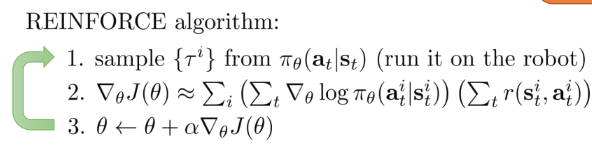
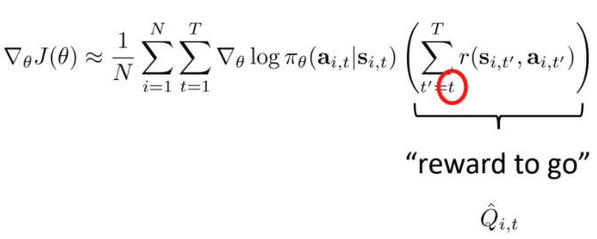
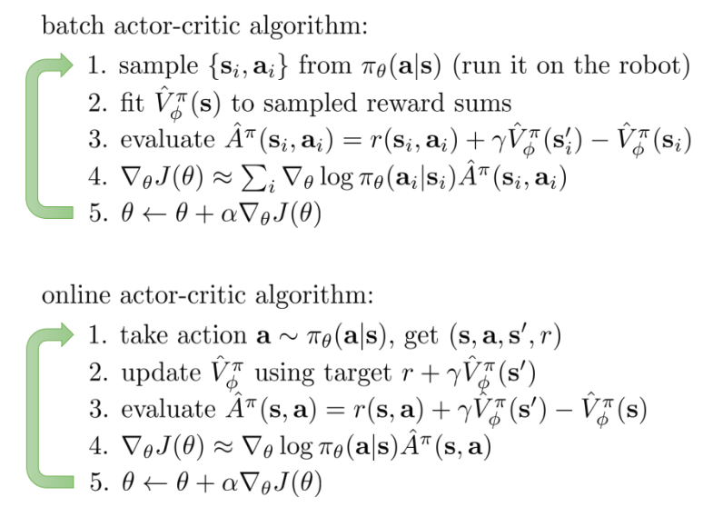

## Original Presentation

- Presenters: Sergey Levine and Chelsea Finn
- Conference: ICML 2017 Tutorial
- URL: https://sites.google.com/view/icml17deeprl

## RL Problem Setup

### Why deep reinforcement learning?

- interpret rich sensory inptus
- choose complex actions
- use deep networks to represent mapping from sensors to actions

### Terminology & Notation

$$
s_t: \text{state} \\
a_t: \text{action} \\
o_t: \text{observation} \\
\pi(a_t | s_t): \text{policy}
$$

## Model-Free RL: policy gradients

### Direct Policy Differentiation

$$
\theta^* = \text{argmax}_{\theta} \sum^T_{t=1} E_{(s_t,q_t) \sim p_{\theta}(s_t,a_t) } [r(s_t, a_t)] = \text{argmax}_{\theta} J(\theta)\\

\pi_{\theta}(s_1, a_1,\dots,s_T,a_T) = \pi_{\theta}(\tau) = p(s_1) \prod^T_{t=1} \pi_{\theta}(a_t | s_t) p(s_{t+1} | s_t, a_t)\\

J(\theta) = E_{\tau \sim p_{\theta}(\tau)} [r(\tau)] = \int \pi_{\theta}(\tau) r(\tau) d\tau \\

\nabla_{\theta} J(\theta) = \int \nabla_{\theta} \pi_{\theta}(\tau) r(\tau) d\tau = \int \pi_{\theta}(\tau) \nabla_{\theta} \log \pi_{\theta}(\tau) r(\tau) d\tau \\

\text{ where } \pi_{\theta}(\tau) \nabla_{\theta} \log \pi_{\theta}(\tau) = \pi_{\theta}(\tau) \frac{\nabla_{\theta} \pi_{\theta}(\tau)}{\pi_{\theta}(\tau)} = \nabla_{\theta} \pi_{\theta}(\tau)\\

\text{ and } \int \pi_{\theta}(\tau) d\tau = 1 \text{ w.r.t } \tau \sim \pi_{\theta}(\tau)\\

\nabla_{\theta} J(\theta) = E_{\tau \sim \pi_{\theta}(\tau)} [\nabla_{\theta} \log \pi_{\theta}(\tau) r(\tau)]\\

\text{ then } \log \pi_{\theta}(\tau) = \log \Big( p(s_1) \prod^T_{t=1} \pi_{\theta}(a_t | s_t) p(s_{t+1} | s_t, a_t) \Big) \\
= \log p(s_1) + \sum^T_{t=1} \log \pi_{\theta}(a_t|s_t) + \log p(s_{t+1} | s_t, a_t) = \sum^T_{t=1} \log \pi_{\theta}(a_t|s_t) \\

\text{ in the end, }\\

\nabla_{\theta} J(\theta) = E_{\tau \sim \pi_{\theta}(\tau)} \Big[ \big(\sum^T_{t=1} \nabla_{\theta} \log \pi_{\theta}(a_t|s_t) \big) \big( \sum^T_{t=1} r(s_t, a_t) \big) \Big]
$$

#### REINFORCE algorithm

Using a back-propagation in neural network, we can make the learning more efficient and accurate and the agent will learn that good stuff is made more likely, a bad stuff is made less likely.

### What is wrong with the policy gradient?

- High variance
- Relatively slow convergence
- Hard to choose learning rate or other parameters

#### Reducing variance

Taking the causality into account

#### Baselines

$$
\nabla_{\theta} J(\theta) \approx \frac{1}{N} \sum^N_{i=1} \nabla_{\theta} \log \pi_{\theta}(\tau) [r(\tau) - b] \\
\text{ where } b = \frac{1}{N} \sum^N_{i=1} r(\tau)\\
E[ \nabla_{\theta} \log \pi_{\theta}(\tau) \times b] = \int \pi_{\theta}(\tau) \nabla_{\theta} \log \pi_{\theta}(\tau) \times b \ d \tau\\
= \int \nabla_{\theta} \pi_{\theta}(\tau) \times b \ d \tau = b \int \nabla_{\theta} \pi_{\theta}(\tau) d \tau = b \nabla_{\theta} 1 = 0
$$

So, introducing a baseline factor(b), we can safely reduce the variance. And as we confirmed that subtracting a baseline is **unbiased** in expectation!

#### Recent approaches

[Q-PROP: SAMPLE-EFFICIENT POLICY GRADIENT WITH AN OFF-POLICY CRITIC by S.Gu et al., 2017](https://arxiv.org/pdf/1611.02247.pdf)

[Trust Region Policy Optimization by J.Schulman et al., 2015](https://arxiv.org/pdf/1502.05477.pdf)

### Review so far

- policy gradient
  - directly differentiate expected reward
  - formalises trial-and-error learning
- Reducing variance
  - use causality
  - use a baseline
- Improve convergence rate
  - Natural/covariant gradient
  - Automatic step adjustment

### Policy gradients suggested readings

- classic papers
  - Williams (1992). Simple statistical gradient-following algorithms for connectionist
    reinforcement learning: introduces REINFORCE algorithm
  - Baxter & Bartlett (2001). Infinite-horizon policy-gradient estimation: temporally
    decomposed policy gradient (not the first paper on this! see actor-critic section later)
  - Peters & Schaal (2008). Reinforcement learning of motor skills with policy gradients:
    very accessible overview of optimal baselines and natural gradient
- Deep reinforcement learning policy gradient papers
  - L. & Koltun (2013). Guided policy search: deep RL with importance sampled policy
    gradient (unrelated to later discussion of guided policy search)
  - Schulman, L., Moritz, Jordan, Abbeel (2015). Trust region policy optimization: deep RL
    with natural policy gradient and adaptive step size
  - Schulman, Wolski, Dhariwal, Radford, Klimov (2017). Proximal policy optimization
    algorithms: deep RL with importance sampled policy gradient

## Model-Free RL: actor-critic algorithms

### Improving the policy evaluation

where, $\hat{Q}_{i,t}$: estimate of expected reward if we take action in that state. So to improve the policy evaluation algorithm further, we can replace the rewards with better representation, which is in this case, Q-values. Also, we can consider state-value function as a baseline. So let's re-write the formula as follows;
$$
Q(s_t, a_t) = \sum^T_{t'=t} E_{\pi_{\theta}}[r(s_{t'}, a_{t'} | s_t, a_t)] \\
V(s_t) = E_{a_t \sim \pi_{\theta}(a_t | s_t)} [Q(s_t, a_t)]\\
\nabla_{\theta} J(\theta) \approx \frac{1}{N} \sum^N_{i=1} \sum^T_{t=1} \nabla_{\theta} \log \pi_{\theta} (a_{i,t} | s_{i,t}) (Q^{\pi}(s_{i,t}, a_{i,t}) - V^{\pi}(s_{i,t})) \\
\text{ where } A^{\pi}(s_t, a_t) = Q(s_t, a_t) - V(s_t)\\
\nabla_{\theta} J(\theta) \approx \sum^N_{i=1} \sum^T_{t=1} \nabla_{\theta} \log \pi_{\theta} (a_{i,t} | s_{i,t}) A^{\pi}(s_{i,t}, a_{i,t})
$$
where $A^{\pi}$ is called **Advantage function** which represents how much better $a_t$ is.

Indeed, we can simplify the horrifying equations above by looking at the original definition of Q-function as follows;
$$
Q^{\pi}(s_t, a_t) = \sum^T_{t'=t} E_{\pi_{\theta}}[r(s_{t'}, a_{t'} | s_t, a_t)] \approx r(s_t, a_t) + V^{\pi}(s_{t+1})\\

\text{ where } A^{\pi}(s_t, a_t) \approx r(s_t, a_t) + V^{\pi}(s_{t+1}) - V^{\pi}(s_t)\\

\nabla_{\theta} J(\theta) \approx \sum^N_{i=1} \sum^T_{t=1} \nabla_{\theta} \log \pi_{\theta} (a_{i,t} | s_{i,t}) A^{\pi}(s_{i,t}, a_{i,t})
$$

### Actor-Critic Algorithms

### Another approach

See Schulman, Moritz, L. Jordan, Abbeel ‘16: Generalized advantage estimation

### Review so far

- Actor-Critic algorithms
  - two neural networks or one shared network with two heads
  - Actor: predict action from state
  - Critic: evaluate state
- Connection to policy gradient
  - just policy gradient with function approximator for advantage
  - Multiple ways to estimate advantage
- Can be batch or online method

### Actor-critic suggested readings

- Classic papers
  - Sutton, McAllester, Singh, Mansour (1999). Policy gradient methods for
    reinforcement learning with function approximation: actor-critic algorithms with
    value function approximation
- Deep reinforcement learning actor-critic papers
  - Mnih, Badia, Mirza, Graves, Lillicrap, Harley, Silver, Kavukcuoglu (2016).
    Asynchronous methods for deep reinforcement learning: A3C -- parallel online
    actor-critic
  - Schulman, Moritz, L., Jordan, Abbeel (2016). High-dimensional continuous
    control using generalized advantage estimation: batch-mode actor-critic with
    blended Monte Carlo and function approximator returns
  - Gu, Lillicrap, Ghahramani, Turner, L. (2017). Q-Prop: sample-efficient policy-
    gradient with an off-policy critic: policy gradient with Q-function control variate

## Model-Free RL: value functions

