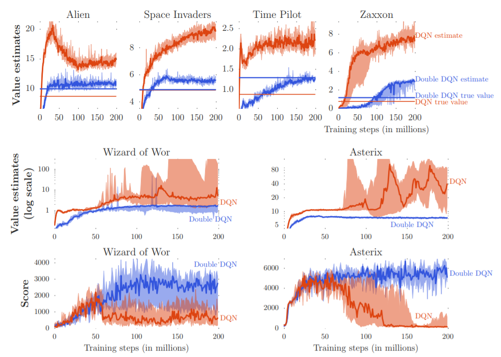
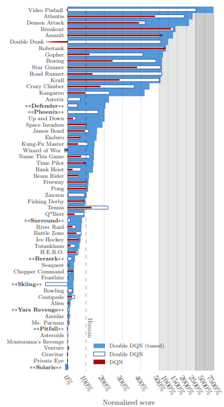

## Previous works

- Issues in Using Function Approximation for Reinforcement Learning by [Sebastian Thrun](https://en.wikipedia.org/wiki/Sebastian_Thrun) and Anton Schwartz, 1993
  - In this paper we identify a prime source of a systematic overestimation of utility values.
- Double Q-learning by Hado van Hasselt, 2011
  - In some stochastic environments the well-known reinforcement learning algorithm Q-learning performs very poorly. This poor performance is caused by large overestimations of action values. 
  - These overestimations result from a positive bias that is introduced because Q-learning uses the maximum action value as an approximation for the maximum expected action value
  - They showed that we can reduce the overestimation in the conventional q-learning algorithm by stochastically update the one of two Q-functions.
- [Reinforcement Learning A Survey by Kaelbling et al., 1996](https://www.cs.cmu.edu/~tom/10701_sp11/slides/Kaelbling.pdf) showed that sometimes the overestimation or overoptimistic attitude of the agent can be beneficial if it happens uniformly over all actions.

## Main Paper

Deep Reinforcement Learning with Double Q-learning by Hado van Hasselt and Arthur Guez and David Silver

## Summary

### Problem statement

The popular Q-learning algorithm is known to overestimate action values under certain conditions, and also even the recent DQN algorithm, which combines Q-learning with a deep neural network, suffers from substantial overestimations in some games in the Atari 2600 domain.

### Prior work

- DQN

$$
Y^{\text{DQN}}_t = R_{t+1} + \gamma \max_a Q(S_{t+1}, a; \theta^-_t)
$$

- Double Q-learning

  - In the original Double Q-learning algorithm, two value functions are learned by assigning each experience randomly to update one of the two value functions, such that there are two sets of weights. For each update, one set of weights is used to determine the greedy policy and the other to determine its value

  - Q-learning
    $$
    Y^Q_t = R_{t+1} + \gamma Q \Big(S_{t+1}, \text{arg}\max_a Q(S_{t+1}, a; \theta_t); \theta_t \Big)
    $$

  - Double Q-learning
    $$
    Y^{\text{DoubleQ}}_t = R_{t+1} + \gamma Q \Big( S_{t+1}, \text{arg}\max_a Q(S_{t+1}, a; \theta_t); \theta_t' \Big)
    $$
    

- Double DQN

  - Its update is the same as for DQN, but replacing the target $Y^{\text{DQN}}_t$ with
    $$
    Y^{\text{DoubleDQN}}_t = R_{t+1} + \gamma Q \Big( S_{t+1}, \text{arg}\max_a Q(S_{t+1}, a; \theta_t); \theta^-_t \Big)
    $$

  - In comparison to the Double Q-learning, we replace the $\theta_t'​$ with the weights of the **target network** $\theta^-_t​$ for the evaluation of the current greedy policy.

  - So, we don't have two Q-value functions as in Double Q-learning so that we use the **target network** as the second network for evaluating the current state. In conventional Q-learning, we evaluate the $(s,a)$ using off-policy Q-function. so this is the point we have to be careful

### Result

the value estimate are computed regularly during training with full evaluation phases of length $T=125,000$ steps as
$$
\frac{1}{T} \sum^T_{t=1} \text{arg}\max_a Q(S_t, a;\theta)
$$

normalised score was calculated as follows;
$$
\text{score}_{\text{normalised}} = \frac{ \text{score}_{\text{agent}} - \text{score}_{\text{random}} }{ \text{score}_{\text{human}} - \text{score}_{\text{random}} }
$$
and it was examined for 5 mins of emulator time(approximately 18,000 frames) with an $\epsilon​$-greedy policy where $\epsilon = 0.05​$. then the score was average over 100 episodes.

### Contributions of the paper

- they have shown why Q-learning can be overoptimistic in large-scale problems, even if these are deterministic, due to the inherent estimation errors of learning
- by analysing the value estimates on Atari games they have shown that these overestimations are more common and severe in practice than previously acknowledged
- they e have shown that **Double Q-learning** can be used at scale to successfully reduce this overoptimism, resulting in more stable and reliable learning
- they e have proposed a specific implementation called Double DQN, that uses the existing architecture and deep neural network of the DQN algorithm without requiring additional networks or parameters
- they have shown that Double DQN finds better policies, obtaining new state-ofthe-art results on the Atari 2600 domain

### My questions

- what about the pessimism of Q-learning(mini max mechanism)?
- is it really good to use the target network as a second network to update? because in double-q-learning, we explicitly initialise the second q-function and randomly update either the second one or first one