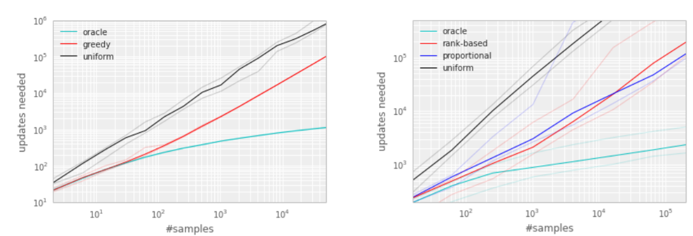
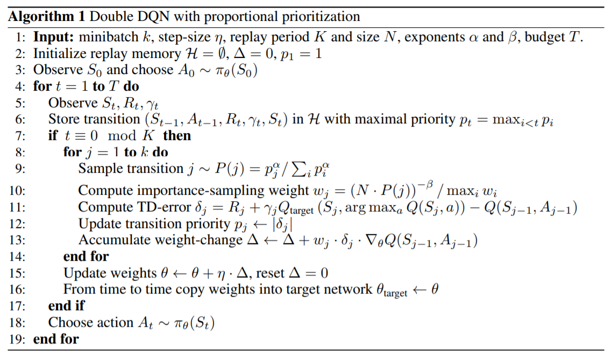

## Main Paper

PRIORITIZED EXPERIENCE REPLAY by Tom Schaul, John Quan, Ioannis Antonoglou and David Silver, ICLR2016

## Summary

### Problem statement

In prior work, experience transitions were uniformly sampled from a replay memory. However, this approach simply replays transitions at the same frequency that they were originally experienced, regardless of their significance.

#### Two issues in online RL

- strongly correlated updates that break the i.i.d. assumption of many popular stochastic gradient-based algorithms
- the rapid forgetting of possibly rare experiences that would be useful later on because they just discard the experiences as soon as they finish learning

### Prior work

- Experience replay (Lin, 1992) addresses both of these issues: with experience stored in a replay
  memory, it becomes possible to break the temporal correlations by mixing more and less recent experience for the updates, and rare experience will be used for more than just a single update

- [Curious model-building control systems by Schmidhuber in 1991](http://people.idsia.ch/~juergen/curioussingapore/curioussingapore.html) showed that Some transitions may not be immediately useful to the agent, but might become so when the agent competence increases

  #### how to prioritise the experiences?

  - **Prioritised sweeping**(Moore & Atkeson, 1993; Andre et al., 1998): It is well-known that planning algorithms such as value iteration can be made more efficient by prioritising updates in an appropriate order. And it selects which state to update next, prioritised according to the change in value, if that update was executed
  - TD-errors have also been used as a prioritisation mechanism for determining where to focus resources, for example when choosing where to explore (White et al., 2014) or which features to
    select (Geramifard et al., 2011; Sun et al., 2011).
  - Use of variants of importance samplings in supervised learning methods

**However**, greedy TD-error prioritisation has several issues. 

- First, to avoid expensive sweeps over the entire replay memory, TD errors are only updated for the transitions that are replayed. One consequence is that transitions that have a low TD error on first visit may not be replayed for a long time entire replay memory, TD errors are only updated for the transitions that are replayed.
- it is sensitive to noise spikes (e.g. when rewards are stochastic), which can be exacerbated by bootstrapping, where approximation errors appear as another source of noise
- the greedy prioritisation focuses on a small subset of the experience: errors shrink slowly, especially when using function approximation, meaning that the initially high error transitions get replayed frequently

### Proposition

To overcome the issues above, they develop a framework which is a stochastic sampling method that interpolates between pure greedy prioritisation and uniform random sampling, so as to replay important transitions more frequently, and therefore learn more efficiently. 

#### Stochastic Prioritisation

they ensure the non-zero probabilities are assigned to any states in the environment
$$
P(i) = \frac{p^{\alpha}_i}{\sum_k p^{\alpha}_k}
$$
where p represents the transition probability and exponent $\alpha$ determines how much prioritisation is used.

the graphs below indicate that the stochastic prioritisation can decrease the required amount of experiences during training. the experiment was conducted by Q-learning agent on Blind Cliffwalk example. and left shows Tabular representation, greedy prioritisation then the right shows linear function approximation, both variants of stochastic prioritisation as below

- Proportional Prioritisation: $p_i = |\delta_i| + \epsilon$ where $\epsilon​$ is a fraction value to ensure all transitions would happen
- rank-based prioritisation: $p_i = \frac{1}{\text{rank}(i)}$ where rank means the rank of transition $i$ when the replay memory is sorted according to $|\delta_i|$

#### Annealing The Bias

Prioritised replay introduces bias because it changes this distribution in an uncontrolled fashion, and therefore changes the solution that the estimates will converge to (even if the policy and state distribution are fixed). so we can correct the bias by using **Weighted Importance Sampling** (Mahmood et al., 2014) as follows;
$$
w_i = \big( \frac{1}{N} \cdot \frac{1}{P(i)} \big)^{\beta} \\
\text{normalisation }w_i = \frac{w_i}{\max_i w_i}
$$

## Algorithm

### Result

#### Trick they used

- they used DQN and Double-DQN as baselines
- Replay size: $10^6$
- Mini-batch size : 32
- Mini-batch update frequency: for each 4 new trainsitions
- TD-errors are clipped to fall within [-1, 1]
- Rank-Based : $\alpha$: 0.7,  $\beta_0$ : 0.5   *These choices are trading off aggressiveness with robustness
- Proportional-Based : $\alpha$: 0.6,  $\beta_0$ : 0.4    *These choices are trading off aggressiveness with robustness
- they additionally examined on new games, such as River Raid, Seaquest and Surround to a human level for the first time

#### Metrics

- Quality of the best policy
- Learning speed

### Human Starts(Nair et al., 2015)

It aims to measure how well the agent generalizes to states it may not have trained on. To that end, we have introduced 100 random starting points that were sampled from a human professional’s game play for each game. To evaluate an agent, we ran it from each of the 100 starting points until the end of the game or until a total of 108000 frames (equivalent to 30 minutes) were played counting  the frames the human played to reach the starting point. The total score accumulated only by the agent (not considering any points won by the human player) were averaged to obtain the evaluation score.

### Conclusion

In the head-to-head comparison between rank-based prioritization and proportional prioritization, we expected the rank-based variant to be more robust because it is not affected by outliers nor error magnitudes. Furthermore, its heavy-tail property also guarantees that samples will be diverse, and the stratified sampling from partitions of different errors will keep the total minibatch gradient at a stable magnitude throughout training