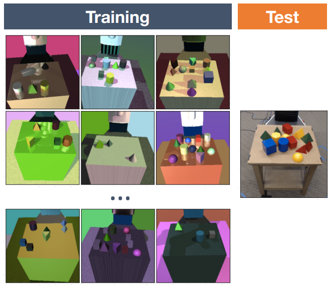
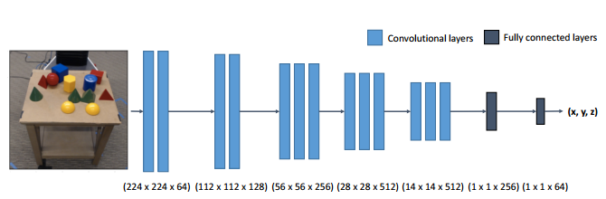

## Main Paper

- Title: Domain Randomization for Transferring Deep Neural Networks from Simulation to the Real World
- Authors: Josh Tobin, Rachel Fong, Alex Ray, Jonas Schneider, Wojciech Zaremba, Pieter Abbeel
- Entities: OpenAI, UC Berkley

## Notes

### Problem Statement

In robotics, **reality gap** that separates simulated robotics from experiments on hardware have long caused the problem which prevents us from directly applying the resultant model of the training to the real world situation. So that, in general, this problem requires us **a lot of manual calibration** before transferring the model from the simulation to the physical robots.

### Approach

So, using **Domain Randomisation**, which is the technique for augmenting the training data by tweaking some components of the environment and make the training more generalisable, they aim to generalise the training result directly to the real world robotic hand control and object localisation in the 3D space. And ideally, we could learn policies that encode complex behaviours entirely in simulation environment and successfully run those policies on physical robots with minimal or no additional training.

#### Domain Randomisation

Instead of training a model on a single simulated environment, we randomly replace some objects in the environment to expose the model to a wide range of environments at training time. And the purpose of applying this technique is that they wanted to verify their question;

- if the variability in simulation is significant enough, models trained in simulation will generalise to the real world with no additional training.

To the best their knowledge, this work was the first ever demonstration that domain randomisation can be useful for robotic tasks require precision.

### Method

#### Domain randomisation

They randomised the following aspects of the domain for each sample used during training

- Number and shape of distractor objects on the table
- Position and texture of all objects on the table
- Textures of the table, floor, skybox, and robot
- Position, orientation, and field of view of the camera
- Number of lights in the scene
- Position, orientation, and specular characteristics of the lights
- Type and amount of random noise added to images

- Textures are chosen uniformly at random among the following;
  - A random RGB value
  - A gradient between two random RGB values
  - A checker pattern between two random RGB values

- Camera images: **MuJoCo Physics Engigne's built-in renderer**
- Number of Distractors: between 0 and 10 objects are added to the table in each scene
- Manually place a camera in the simulated scene that approximately matches the viewpoint and field of view of the real camera
- Image size: (224x224) RGB

#### Model Architecture

- ReLU activations are used through, and max pooling occurs between each of the groupings of convolutional layers as well
- Input: Images(224x224) RGB
- Ouput:  $(x, y, z)​$ **Cartesian Coordinates**.
- $L_2$ loss function
- Stochastic Gradient Descent
- Adam optimisation with the learning rate of $1e-4​$

### Results

