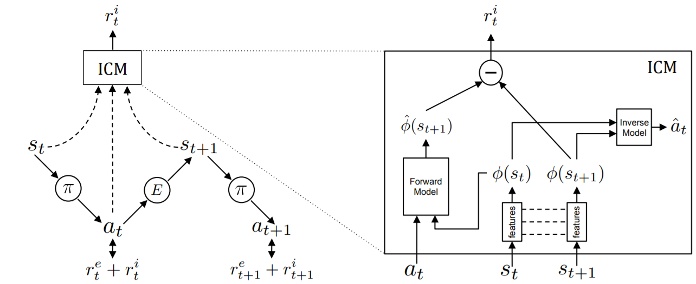
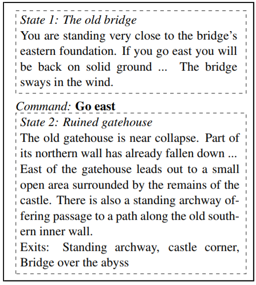

## Reference

https://ieeexplore.ieee.org/stamp/stamp.jsp?tp=&arnumber=8632747&tag=1

## DRL approaches Taxonomy

### Arcade Games

- [DQN](https://www.cs.toronto.edu/~vmnih/docs/dqn.pdf)

  - DQN was tested in seven Atari 2600 games and outperformed previous approaches, such as SARSA with feature construction as well as a human expert on three of the games.

    

- [Deep Recurrent Q-Learning (DRQN)](https://arxiv.org/pdf/1507.06527.pdf)

  - extends the DQN architecture with a recurrent layer before the output and works well for games with partially observable states

    

- [Gorila architecture (General Reinforcement Learning Architecture)](https://arxiv.org/pdf/1507.04296.pdf)

  - A distributed version of DQN was shown to outperform a non-distributed version in 41 of the 49 games 

  - Gorila parallelizes actors that collect experiences into a distributed replay memory as well as parallelizing learners that train on samples from the same replay memory.

    

- [Double DQN](https://arxiv.org/pdf/1509.06461.pdf)

  - reduces the observed overestimation by learning two value networks with parameters that both use the other network for value-estimation

- [prioritized experience replay](https://arxiv.org/pdf/1511.05952.pdf)

  - important experiences are sampled more frequently based on the TD-error, which was shown to significantly improve both DQN and Double DQN

    

- [Dueling DQN](https://arxiv.org/pdf/1511.06581.pdf)

  - uses a network that is split into two streams after the convolutional layers to separately estimate state-value and the action-advantage functions.

  - The main benefit of this factoring is to generalise learning across actions without imposing any change to the underlying reinforcement learning algorithm. 

  - Dueling DQN improves Double DQN and can also be combined with prioritized experience replay

    

- [Bootstrapped DQN](https://arxiv.org/pdf/1602.04621.pdf)

  - improves exploration by training multiple Q-networks. A randomly sampled network is used during each training episode and bootstrap masks modulate the gradients to train the networks differentlly

    

- [Asynchronous Advantage Actor-Critic (A3C)](https://arxiv.org/pdf/1602.01783.pdf)

  - an actor-critic method that uses several parallel agents to collect experiences that all asynchronously update a global actor-critic network without **replay memory**

  - A3C outperformed Prioritized Dueling DQN, which was trained for 8 days on a GPU, with just half the training time on a CPU

    

- [actor-critic method with experience replay (ACER)](https://arxiv.org/pdf/1611.01224.pdf)

  - implements an efficient trust region policy method that forces updates to not deviate far from a running average of past policies
  - It is much more data efficient

- [Advantage Actor-Critic (A2C)](Asynchronous Methods for Deep Reinforcement Learning)

  - a synchronous variant of A3C 
  - updates the parameters synchronously in batches and has comparable performance while only maintaining one neural network

- [Actor-Critic using Kronecker-Factored Trust Region (ACKTR)](Scalable trust-region method for deep reinforcement
  learning using Kronecker-factored approximation)

  - extends A2C by approximating the natural policy gradient updates for both the actor and the critic

- [Trust Region Policy Optimization (TRPO)](https://arxiv.org/pdf/1502.05477.pdf)

  - uses a surrogate objective with theoretical guarantees for monotonic policy improvement, while it practically implements an approximation called trust region by constraining network updates with a bound on the KL divergence between the current and the updated policy.
  - robust and data efficient performance in Atari games while it has high memory requirements and several restrictions

- [Proximal Policy Optimization (PPO)](https://arxiv.org/pdf/1707.06347.pdf)

  - an improvement on TRPO that uses a similar surrogate objective but instead uses a soft constraint by adding the KL-divergence as a penalty

  - while it does not rely on **replay memory,** it has comparable or better performance than TRPO in continuous control tasks.

    

- [IMPALA (Importance Weighted Actor-Learner Architecture)](https://arxiv.org/pdf/1802.01561.pdf)

  - an actor-critic method where multiple learners with GPU access share gradients between each other while being synchronously updated from a set of actors

- [UNREAL (UNsupervised REinforcement and Auxiliary Learning)](https://arxiv.org/pdf/1611.05397.pdf)

  - based on A3C but uses a replay memory from which it learns auxiliary tasks and pseudo-reward functions concurrently

    

- [Distributional DQN](https://arxiv.org/pdf/1707.06887.pdf)
  - takes a distributional perspective on reinforcement learning by treating Q-function as an approximate distribution of returns instead of a single approximate expectation for each action as it is in the conventional setting.

  - The distribution is divided into a so-called set of atoms, which determines the granularity of the distribution.

    

- [NoisyNets](https://arxiv.org/pdf/1706.10295.pdf)

  - noise is added to the network parameters and a unique noise level for each parameter is learned using gradient descent, in contrast to the conventional epsilon-greedy exploration, NoisyNets use a noisy version of the policy to ensure exploration

    

- [Rainbow](https://arxiv.org/pdf/1710.02298.pdf)

  - combines several DQN enhancements: Double DQN, Prioritized Replay, Dueling DQN, Distributional DQN, and NoisyNets, and achieved a mean score higher than any of the enhancements individually

    

- Evolution Strategies (ES)
  - are black-box optimization algorithms that rely on parameter-exploration through stochastic noise. 720 CPUs were used for one hour whereafter ES managed to outperform A3C (which ran for 4 days) in 23 out of 51 games

- [Deep GA](https://arxiv.org/pdf/1712.06567.pdf)
  - A simple genetic algorithm with a Gaussian noise mutation operator evolves the parameters of a deep neural network and can achieve surprisingly good scores across several Atari games

- [UCTtoClassification](http://papers.nips.cc/paper/5421-deep-learning-for-real-time-atari-game-play-using-offline-monte-carlo-tree-search-planning.pdf)

  - a slow planning agent was applied offline, using Monte-Carlo Tree Search, to generate data for training a CNN via multinomial classification. And it was shown to outperform DQN.

- [Policy Distillation](https://arxiv.org/pdf/1511.06295.pdf)

  - for transferring one or more action policies from Q-networks to an untrained network.

  - The method has multiple advantages: network size can be compressed by up to 15 times without degradation in performance; multiple expert policies can be combined into a single multi-task policy that can outperform the original experts; and finally it can be applied as a real-time, online learning process by continually distilling the best policy to a target network, thus efficiently tracking the evolving Q-learning policy.

    

- [Actor-Mimic](https://arxiv.org/pdf/1511.06342.pdf)
  - exploits the use of deep reinforcement learning and model compression techniques to train a single policy network that learns how to act in a set of distinct tasks by using the guidance of several expert teachers

- [Hybrid Reward Architecture (HRA)](https://ieeexplore.ieee.org/stamp/stamp.jsp?tp=&arnumber=8632747&tag=1)

  - The training objective provides feedback to the agent while the performance objective specifies the target behavior. Often, a single reward function takes both roles, but for some games, the performance objective does not guide the training sufficiently

  - The Hybrid Reward Architecture (HRA) splits the reward function into n different reward functions, where each of them are assigned a separate learning agent

    

### Montezuma’s Revenge(sparse feedback problem)

Most of the algorithms introduced above have failed to learn the sparse feedback through the game. For instance, DQN fails to obtain any reward in this game (receiving a score of 0) and Gorila achieves an average score of just 4.2, whereas a human expert scored 4,367. So, it is clear that the methods presented so far are unable to deal with environments with such sparse rewards.

- [Hierarchical-DQN (h-DQN) ](https://arxiv.org/pdf/1604.06057.pdf)

  - A top-level value function learns a policy over intrinsic goals, and a lower-level function learns a policy over atomic actions to satisfy the given goals. 

  - it operates on two temporal scales inside, one is the controller which leans a policy over action that satisfy goals chosen by a higher-level Q-value function, on the other hand, we have the meta-controller which learns a policy over intrinsic goals.

    

    

- [DQN-CTS(DQN-Context Tree Switching)](https://arxiv.org/pdf/1606.01868.pdf)
  - Pseudo-counts have been used to provide intrinsic motivation in the form of exploration bonuses when unexpected pixel configurations are observed and can be derived from CTS density models
  - they focus on the problem of exploration in non-tabular reinforcement learning
  - they use density models to measure uncertainty, and propose a novel algorithm for deriving a pseudo-count from an arbitrary density model. 
  - [Skip Context Tree Switching: Bellemare et al., 2014](https://pdfs.semanticscholar.org/f6ca/9c148417d4167ba8b72f185a35649dc4b446.pdf)
    - In this paper we show how to generalize this technique to the class of K-skip prediction suffix trees. 
- [DQN-PixelCNN](http://proceedings.mlr.press/v70/ostrovski17a/ostrovski17a.pdf)
  - they combine PixelCNN pseudo-counts with different agent architectures to dramatically improve the state of the art on several hard Atari games

- [Ape-X DQN](https://openreview.net/pdf?id=H1Dy---0Z)
  - a distributed DQN architecture similar to Gorila

- [Deep Qlearning from Demonstrations (DQfD) ](https://arxiv.org/pdf/1704.03732.pdf)

  - draw samples from an experience replay buffer that is initialized with demonstration data from a human expert and is superior to previous methods on 11 Atari games with sparse rewards

    

- [Ape-X DQfD](https://arxiv.org/pdf/1805.11593.pdf)

  - combines the distributed architecture from Ape-X and the learning algorithm from DQfD using expert data and was shown to outperform all previous methods in ALE as well as beating level 1 in Montezuma’s Revenge

    

- [Natural Language Guided Reinforcement Learning](https://arxiv.org/pdf/1704.05539.pdf)

  - The agent uses a multi-modal embedding between environment observations and natural language to self-monitor progress through a list of English instructions, granting itself reward for completing instructions in addition to increasing the game score

  - Instructions were linked to positions in rooms and agents were rewarded when they reached those locations

  - 

    

- [language acquisition in virtual environment](https://arxiv.org/pdf/1703.09831.pdf)

  - how an agent can execute text-based commands in a 2D maze-like environment called XWORLD, such as walking to and picking up objects, after having learned a teacher’s language

  - An RNN-based language module is connected to a CNN-based perception module. These two modules were then connected to an action selection module and a recognition module that learns the teacher’s language in a question answering process.

    

    

### Racing Games

- [Direct Perception](http://openaccess.thecvf.com/content_iccv_2015/papers/Chen_DeepDriving_Learning_Affordance_ICCV_2015_paper.pdf)
  - a CNN learns to map from images to meaningful affordance indicators, such as the car angle and distance to lane markings, from which a simple controller can make decisions.
  - Direct perception was trained on recordings of 12 hours of human driving in TORCS and the trained system was able to drive in very diverse environments. Amazingly, the network was also able to generalize to real images.
- [Deterministic Policy Gradient (DPG)](http://www0.cs.ucl.ac.uk/staff/d.silver/web/Publications_files/deterministic-policy-gradients.pdf)
  - directly differentiate the policy and try approximate it by neural network

- [Deep DPG (DDPG)](https://arxiv.org/pdf/1509.02971.pdf)

  - a policy gradient method that implements both experience replay and a separate target network and was used to train a CNN endto-end in TORCS from images

    

### First-Person Shooters

- [ViZDoom](https://arxiv.org/pdf/1605.02097.pdf)

  - demonstrated that a CNN with maxpooling and fully connected layers trained with DQN canachieve human-like behaviors in basic scenarios. In the Visual Doom AI Competition 2016

- [Actor-Critic (A3C) with Curriculum Learning](https://openreview.net/pdf?id=Hk3mPK5gg)

  - Reward shaping tackled the problem of sparse and delayed rewards, giving artificial positive rewards for picking up items and negative rewards for using ammunition and losing health.

  - Curriculum learning attempts to speed up learning by training on a set of progressively harder environments

    

    

- [SLAM-Augmented Deep Reinforcement Learning](https://arxiv.org/pdf/1612.00380.pdf)
  - Position inference and object mapping from pixels and depth-buffers using Simultaneous Localization and Mapping (SLAM) also improve DQN in Doom
  - they approached the issue that partial observability of the environment using the SLAM generated map for an agent to be aware where it is right now.

- [Direct Future Prediction (DFP)](https://arxiv.org/pdf/1611.01779.pdf)

  - The architecture used in DFP has three streams: one for the screen pixels, one for lower-dimensional measurements describing the agent’s current state and one for describing the agent’s goal, which is a linear combination of prioritized measurements.

  - DFP collects experiences in a memory and is trained with supervised learning techniques to predict the future measurements based on the current state, goal and selected action

  - During training, actions are selected that yield the best-predicted outcome, based on the current goal. This method can be trained on various goals and generalizes to unseen goals at test time.

    

- [Navigation with RL(Nav A3C)](https://arxiv.org/pdf/1611.03673.pdf)

  - they formulate the navigation question as a reinforcement learning problem and show that data efficiency and task performance can be dramatically improved by relying on additional auxiliary tasks leveraging multi-modal sensory inputs

    

- Distral (Distill & transfer learning)

  - trains several worker policies (one for each task) concurrently and shares a distilled policy that captures common behaviour across tasks

  - The worker policies are regularized to stay close to the shared policy which will be the centroid of the worker policies. Distral was applied to DeepMind Lab.

    

- [Intrinsic Curiosity Module (ICM)](https://pathak22.github.io/noreward-rl/resources/icml17.pdf)

  - curiosity can serve as an intrinsic reward signal to enable the agent to explore its environment and learn skills that might be useful later in its life.

  - they formulate curiosity as the error in an agent’s ability to predict the consequence of its own actions in a visual  feature space learned by a self-supervised inverse dynamics model.

    

### Open-World Games

- [H-DRLN](https://arxiv.org/pdf/1604.07255.pdf)

  - architecture implements a lifelong learning framework, which is shown to be able to transfer knowledge between simple tasks in Minecraft such as navigation, item collection, and placement tasks

    

- [Teacher-Student Curriculum Learning (TSCL)](https://arxiv.org/pdf/1707.00183.pdf)

  - a framework for automatic curriculum learning, where the Student tries to learn a complex task and the Teacher automatically chooses subtasks from a given set for the Student to train on.

  - framework incorporates a teacher that prioritizes tasks wherein the student’s performance is either increasing (learning) or decreasing (forgetting)

    

### Real-Time Strategy Games

- players have to control multiple agents simultaneously in real-time on a partially observable map. 
- RTS games have no in-game scoring and thus the reward is determined by who wins the game.

- [Monte Carlo Tree Search(MCTS)](https://skatgame.net/mburo/ps/cig16-eval.pdf)

  - they present a CNN for RTS game state evaluation that goes beyond commonly used material based evaluations by also taking spatial relations between units into account.

    

- [Multi-agent credit assignment problem](https://papers.nips.cc/paper/2476-all-learning-is-local-multi-agent-learning-in-global-reward-games.pdf)
  - States and actions are often described locally relative to units, which is extracted from the game engine. If agents are trained individually it is difficult to know which agents contributed to the global reward 

So we will look at some MARL(Multi-agent RL) approaches

- [Independent Q-learning (IQL)](http://web.media.mit.edu/~cynthiab/Readings/tan-MAS-reinfLearn.pdf)
  - Given the same number of reinforcement learning agents will cooperative agents outperform independent agents who do not communicate during learning?
  - IQL simplifies the multi-agent RL problem by controlling units individually while treating other agents as if they were part of the environment

- Multiagent Bidirectionally-Coordinated Network (BiCNet)

  - implements a vectorized actor-critic framework based on a bi-directional RNN, with one dimension for every agent, and outputs a sequence of actions

  - BiCNet can handle different types of combats with arbitrary numbers of AI agents for both sides. Our analysis demonstrates that without any supervisions such as human demonstrations or labelled data, BiCNet could learn various types of advanced coordination strategies that have been commonly used by experienced game players

    

- [Counterfactual multi-agent (COMA)](https://arxiv.org/pdf/1705.08926.pdf)

  - policy gradients is an actor-critic method with a centralized critic and decentralized actors that address the multi-agent credit assignment problem with a counterfactual baseline computed by the critic network

    

- [Convolutional Neural Network Fitted Q-Learning](https://ieeexplore.ieee.org/stamp/stamp.jsp?tp=&arnumber=8426160)

  - trained with Double DQN for build-order planning in StarCraft II and was able to win against medium level scripted bots on small maps

    

### Text Adventure Games

- [LSTM-DQN](https://arxiv.org/pdf/1506.08941.pdf)

  - the task of learning control policies for text-based games. In these games, all interactions in the virtual world are through text and the underlying state is not observed.

  - This framework enables us to map text descriptions into vector representations that capture the semantics of the game states.

    

- [Deep Reinforcement Relevance Net (DRRN)](http://www.aclweb.org/anthology/P16-1153)

  - the architecture represents action and state spaces with separate embedding vectors, which are combined with an interaction function to approximate the Q-function in reinforcement learning.

  - This approach has two networks that learn word embeddings. One embeds the state description, the other embeds the action description. Relevance between the two embedding vectors is calculated with an interaction function such as the inner product of the vectors or a bilinear operation.

  - The Relevance is then used as the Q-Value and the whole process is trained end-to-end with Deep Q-Learning. This approach allows the network to generalize to phrases not seen during training which is an improvement for very large text games. The approach was tested on the text games Saving John and Machine of Death, both choice-based games.

    

- [Affordance Extraction via Word Embeddings](https://www.ijcai.org/proceedings/2017/0144.pdf)
  - Affordance(**affordances**: the set of behaviors enabled by a situation) detection is particularly helpful in domains with large action spaces, allowing the agent to prune its search space by avoiding futile behaviors.
  - A word embedding is first learned from a Wikipedia Corpus via unsupervised learning and this embedding is then used to calculate analogies such as song is to sing as bike is to x, where x can then be calculated in the embedding space
  - The authors build a dictionary of verbs, noun pairs, and another one of object manipulation pairs. Using the learned affordances, the model can suggest a small set of actions for a state description. Policies were learned with Q-Learning and tested on 50 Z-Machine games.
- [Golovin Agent](https://arxiv.org/pdf/1705.05637.pdf)
  - exclusively on language models Using word embeddings, the agent can replace synonyms with known words. Golovin is built of five command generators: General, Movement, Battle, Gather, and Inventory. These are generated by analyzing the state description, using the language models to calculate and sample from a number of features for each command. Golovin uses no reinforcement learning and scores comparable to the affordance method.

- [AEN(Action Elimination Network)](https://papers.nips.cc/paper/7615-learn-what-not-to-learn-action-elimination-with-deep-reinforcement-learning.pdf)
  - propose the Action-Elimination Deep Q-Network (AE-DQN) architecture that combines a Deep RL algorithm with an Action Elimination Network (AEN) that eliminates sub-optimal actions. The AEN is trained to predict invalid actions, supervised by an external elimination signal provided by the environment.
  - In parser-based games, the actions space is very large. The AEN learns, while playing, to predict which actions that will have no effect for a given state description. The AEN is then used to eliminate most of the available actions for a given state and after which the remaining actions are evaluated with the Q-network. The whole process is trained end-to-end and achieves similar performance to DQN with a manually constrained actions space. Despite the progress made for text adventure games, current techniques are still far from matching human performance