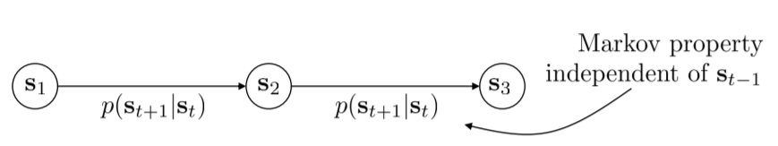
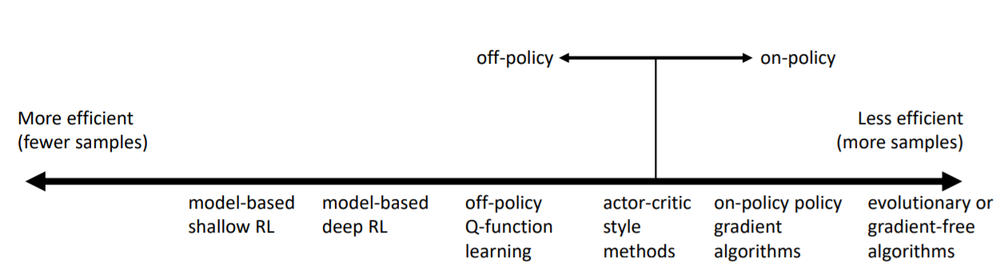

## URL

[Lecture 4: Reinforcement Learning Introduction](http://rail.eecs.berkeley.edu/deeprlcourse/static/slides/lec-4.pdf)

## Notes ~Introduction to Reinforcement Learning~ 

### Definition of a MDP

$$
M = \{S, T \} \\
S: \text{State space(discrete or continuous) , } s \in S \\
A: \text{Action space(discrete or continuous) , } a \in A \\
T: \text{Transition Matrix} \\
r: \text{Reward function , } r: S \times A \rightarrow \mathbb{R}
$$

### Definition of RL problem

Given a trajectory, we would like a policy which maximise the long term reward.
$$
\underbrace{p_{\theta}(s_1, a_1, \dots, s_T, a_T)}_{p_{\theta}(\tau)} = p(s_1) \prod^T_{t=1} \pi_{\theta}(a_t | s_t) p(s_{t+1} | s_t, a_t)\\
\theta^* = \text{argmax}_{\theta} E_{\tau \sim p_{\theta}(\tau)} \Big[ \sum_t r(s_t | a_t) \Big]\\
= \text{argmax}_{\theta} \sum^T_{t=1} E_{(s_t, a_t) \sim p_{\theta}(s_t, a_t)} \Big[ r(s_t, a_t) \Big]
$$

### Anatomy of a RL algorithm

- generate samples
- fit a model and estimate the return
- improve the policy

$$
Q^{\pi}(s_t, a_t) = \sum^T_{t'=t} E_{\pi^{\theta}} \big[ r(s_{'t}, a_{t'} | s_t, a_t) \big] \text{: total reward from taking } a_t \text{ in } s_t\\
V^{\pi}(s_t) = \sum^T_{t'=t} E_{\pi^{\theta}} \big[ r(s_{'t}, a_{t'} | s_t) \big] \\
= E_{a_t \sim \pi(a_t | s_t)} \big[ Q^{\pi}(s_t, a_t) \big]
$$

#### Two ideas for Q-values and state-value functions

1. if we have policy $\pi$, and we know $Q^{\pi}(s,a)$, then we can improve $\pi$.**Deterministic policy**
2. Compute gradient to increase probability of good actions: **Action which has the maximum value is the optimal**

#### Review

- Definitions
  - Markov chain
  - MDP
- RL Objectives
  - Expected Reward
  - How to evaluate expected reward?
- Structure of RL algorithms
  - sample generation
  - fitting a model/estimating return
  - Policy improvement
- Value functions and Q-functions

### Brief Overview of RL algorithm types

- Policy Gradients: directly differentiate the objective function to optimise an approximated policy by some ML algorithms, e.g., Neural Networks.
- Value-based: estimate value function of Q-function of the optimal policy
- Actor-Critic: estimate value function of Q-function of the current policy, use it to improve policy
- Model-based RL: estimate the transition model, and then
  - use it for planning on the pre-defined environment
  - use it to improve a policy
  - something else..

#### Model-based RL(Dyna, Guided Policy Search etc.)

you need to somehow model the environment, then you can use algorithms like, Dynamic Programming or Search Trees.

#### Value function based algorithms(Q-learning, DQN, TD etc.)

you fit value-functions($V(s), Q(s,a)​$), then set the objective function as $\pi(s) = \text{argmax}_{\theta} Q(s,a)​$

#### Direct policy gradients(REINFORCE, Natural Policy Gradient TRPO etc.)

you evaluate the returns like: $R_t = \sum_r r(s_t, a_t)$, then do an optimisation as follows
$$
\theta \leftarrow \theta + \alpha \nabla_{\theta} E\big[ \sum_t r(s_t, a_t) \big]
$$

#### Actor-critic: value functions + policy gradients(A3C, Soft Actor-Critic(SAC)) etc.

you fit value-functions($V(s), Q(s,a)$), then set the objective function as 
$$
\theta \leftarrow \theta + \alpha \nabla_{\theta} E\big[ \sum_t r(s_t, a_t) \big]
$$

#### Comparison: sample efficiency

