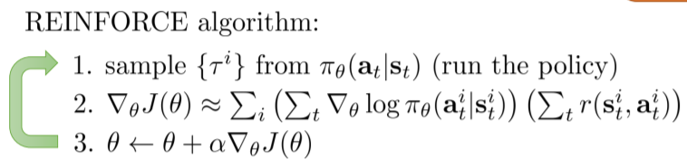
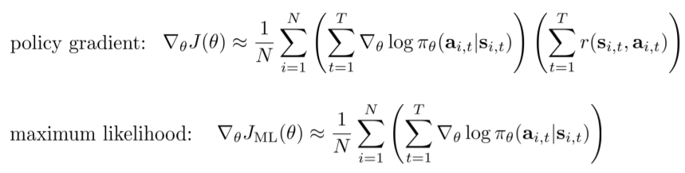
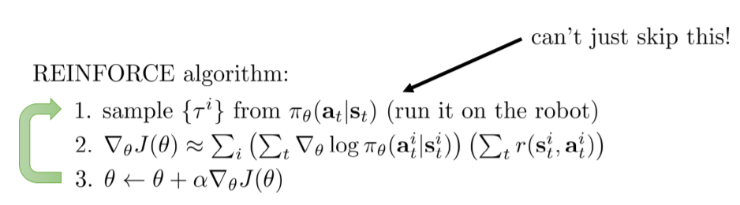
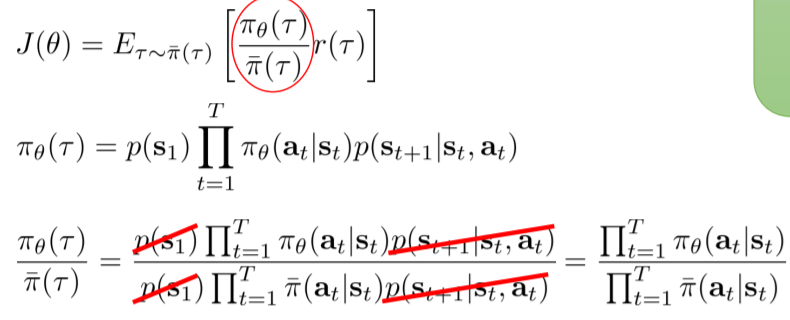

## The Policy Gradient Algorithm

### Goal of RL

We would like to find a policy which maximise the long-term reward
$$
\theta^* = \text{argmax}_{\theta} E_{\tau \sim p_{\theta}(\tau)} \Big[\sum_t r(s_t, a_t) \Big]\\

\theta^* = \text{argmax}_{\theta} E_{\tau \sim p_{\theta}(\tau)} \Big[\sum_t r(s_t, a_t) \Big] = \text{argmax}_{\theta} J(\theta) \\
J(\theta) \approx \frac{1}{N} \sum^N_i \sum^T_i r(s_{i,t}, a_{i,t})
$$

### Direct Policy Differentiation

$$
\theta^* = \text{argmax}_{\theta} \sum^T_{t=1} E_{(s_t,q_t) \sim p_{\theta}(s_t,a_t) } [r(s_t, a_t)] = \text{argmax}_{\theta} J(\theta)\\

\pi_{\theta}(s_1, a_1,\dots,s_T,a_T) = \pi_{\theta}(\tau) = p(s_1) \prod^T_{t=1} \pi_{\theta}(a_t | s_t) p(s_{t+1} | s_t, a_t)\\

J(\theta) = E_{\tau \sim p_{\theta}(\tau)} [r(\tau)] = \int \pi_{\theta}(\tau) r(\tau) d\tau \\

\nabla_{\theta} J(\theta) = \int \nabla_{\theta} \pi_{\theta}(\tau) r(\tau) d\tau = \int \pi_{\theta}(\tau) \nabla_{\theta} \log \pi_{\theta}(\tau) r(\tau) d\tau \\

\text{ where } \pi_{\theta}(\tau) \nabla_{\theta} \log \pi_{\theta}(\tau) = \pi_{\theta}(\tau) \frac{\nabla_{\theta} \pi_{\theta}(\tau)}{\pi_{\theta}(\tau)} = \nabla_{\theta} \pi_{\theta}(\tau)\\

\text{ and } \int \pi_{\theta}(\tau) d\tau = 1 \text{ w.r.t } \tau \sim \pi_{\theta}(\tau)\\

\nabla_{\theta} J(\theta) = E_{\tau \sim \pi_{\theta}(\tau)} [\nabla_{\theta} \log \pi_{\theta}(\tau) r(\tau)]\\

\text{ then } \log \pi_{\theta}(\tau) = \log \Big( p(s_1) \prod^T_{t=1} \pi_{\theta}(a_t | s_t) p(s_{t+1} | s_t, a_t) \Big) \\
= \log p(s_1) + \sum^T_{t=1} \log \pi_{\theta}(a_t|s_t) + \log p(s_{t+1} | s_t, a_t) = \sum^T_{t=1} \log \pi_{\theta}(a_t|s_t) \\

\text{ in the end, }\\

\nabla_{\theta} J(\theta) = E_{\tau \sim \pi_{\theta}(\tau)} \Big[ \big(\sum^T_{t=1} \nabla_{\theta} \log \pi_{\theta}(a_t|s_t) \big) \big( \sum^T_{t=1} r(s_t, a_t) \big) \Big]
$$

### REINFORCE algorithm

### Evaluating the policy gradient

We can consider the maximise the action space distribution with regard to the parameter $\theta$ in maximum likelihood perspective.

## What does the policy gradient do?

Using the optimisation method for the neural network or other representation of the policy, we can gradually let the agent learn what is good or bad and make the stuffs happen more often or less accordingly through the process of trial and error. REINFORCE algorithm is a part of it.

### What is wrong with the policy gradient?

Cumulative reward from the beginning of an episode can vary quite a lot across episodes in the end. Or even worse, what if the two `good` samples happen to have 0 reward??

## Basic Variance reduction: causality

So, to reduce the variance in the reward distribution, we would use causality first.

*Causality*: polity at time t' cannot affect reward at time t given t<t'. so we just get rid of them from the equation.

## Basic variance reduction: baselines

$$
\nabla_{\theta} J(\theta) \approx \frac{1}{N} \sum^N_{i=1} \nabla_{\theta} \log \pi_{\theta}(\tau) [r(\tau) - b] \\
\text{ where } b = \frac{1}{N} \sum^N_{i=1} r(\tau)\\
E[ \nabla_{\theta} \log \pi_{\theta}(\tau) \times b] = \int \pi_{\theta}(\tau) \nabla_{\theta} \log \pi_{\theta}(\tau) \times b \ d \tau\\
= \int \nabla_{\theta} \pi_{\theta}(\tau) \times b \ d \tau = b \int \nabla_{\theta} \pi_{\theta}(\tau) d \tau = b \nabla_{\theta} 1 = 0
$$

### Analysing variance

$$
Var[x] = E[x^2] - E[x]^2 \\
\nabla_{\theta} J(\theta) = E_{\tau \sim \pi_{\theta}(\tau)} \big[ \nabla_{\theta} \log \pi_{\theta}(\tau) (r(\tau) - b) \big] \\

Var = E_{\tau \sim \pi_{\theta}(\tau)} \Big[ \big( \nabla_{\theta} \log \pi_{\theta}(\tau) (r(\tau) - b) \big)^2 \Big] - E_{\tau \sim \pi_{\theta}(\tau)} \big[ \nabla_{\theta} \log \pi_{\theta}(\tau) (r(\tau) - b) \big]^2 \\

E_{\tau \sim \pi_{\theta}(\tau)} \big[ \nabla_{\theta} \log \pi_{\theta}(\tau) (r(\tau) - b) \big]^2 = \Big( E_{\tau \sim \pi_{\theta}(\tau)} \big[ \nabla_{\theta} \log \pi_{\theta}(\tau)r(\tau)\big] - E_{\tau \sim \pi_{\theta}(\tau)} \big[\nabla_{\theta} \log \pi_{\theta}(\tau) \times b \big] \Big)^2 \\

\text{since a baseline in expectation is 0, we will rewrite the equation as follows;} \\

Var = E_{\tau \sim \pi_{\theta}(\tau)} \Big[ \big( \nabla_{\theta} \log \pi_{\theta}(\tau) (r(\tau) - b) \big)^2 \Big] - E_{\tau \sim \pi_{\theta}(\tau)} \big[ \nabla_{\theta} \log \pi_{\theta}(\tau) (r(\tau)) \big]^2 \\

\frac{\partial Var}{\partial b} = \frac{\partial}{\partial b} E_{\tau \sim \pi_{\theta}(\tau)} \Big[ \big( \nabla_{\theta} \log \pi_{\theta}(\tau) (r(\tau) - b) \big)^2 \Big] = \frac{\partial}{\partial b} E_{\tau \sim \pi_{\theta}(\tau)} \Big[ \big( g(\tau) (r(\tau) - b) \big)^2 \Big] \\

= \frac{\partial}{\partial b} E \Big[ g(\tau)^2 (r(\tau) - b)^2 \Big] = -2 E[g(\tau)^2 r(\tau)] + 2b E[g(\tau)^2] = 0 \\

b = \frac{E[g(\tau)^2 r(\tau)]}{E[g(\tau)^2]}
$$

This is just expected reward, but weighted by gradient magnitudes!

## Policy Gradient Examples

### Policy gradient is on-policy

On-policy learning can be extremely inefficient!

### Off-policy learning & importance sampling

#### Importance Sampling

$$
E_{x \sim p(x)} [f(x)] = \int p(x) f(x) dx\\
= \int \frac{q(x)}{q(x)} p(x) f(x) dx \\
= \int \frac{p(x)}{q(x)} q(x) f(x) dx \\
= E_{x \sim q(x)} \Big[ \frac{p(x)}{q(x)}f(x) \Big]
$$

using IS you can convert this on-policy into off-policy learning.

just ignore the later materials.