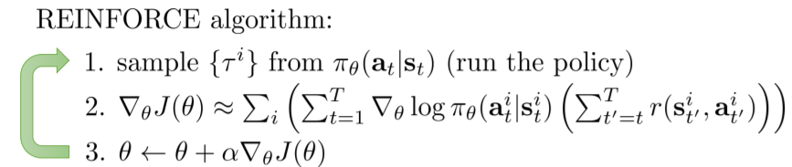
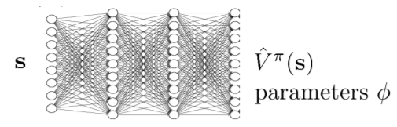
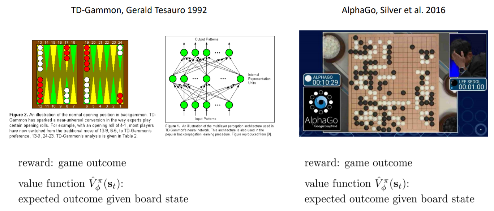
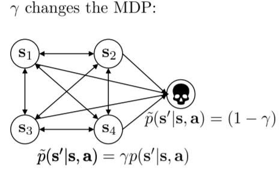
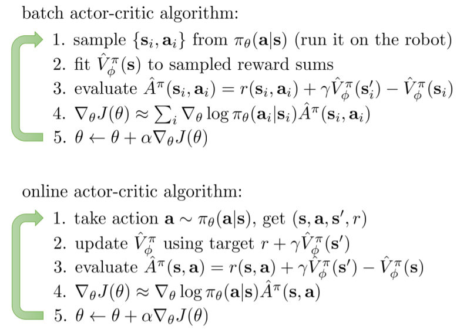
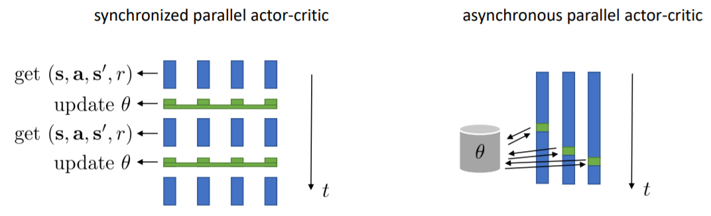
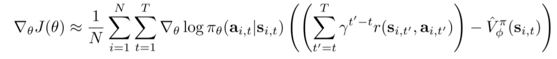

## Reference

http://rail.eecs.berkeley.edu/deeprlcourse/static/slides/lec-6.pdf

## Notes: Actor-Critic Algorithms

### Improving the policy gradient with a critic

#### Recap: policy gradients

$$
\nabla_{\theta}J(\theta) \approx \frac{1}{N} \sum^N_{i=1} \sum^T_{t=1} \nabla_{\theta} \log \pi_{\theta}(a^i_t | s^i_t) \hat{Q}^{\pi}_{i,t}
$$

#### Improving the policy gradient

Instead of getting directly reward, what if we get the value which indicate the action is better than the average or not, which is the baseline in common term.
$$
\nabla_{\theta}J(\theta) \approx \frac{1}{N} \sum^N_{i=1} \sum^T_{t=1} \nabla_{\theta} \log \pi_{\theta}(a^i_t | s^i_t) (Q^{\pi}(s^i_t, a^i_t) - V(s^i_t))
$$

#### Advantage function

it tells us how much better $a_t​$ is.
$$
Q^{\pi}(s_t, a_t) = \sum^T_{t'=t} E_{\pi_{\theta}} [r(s_{t'},a_{t'}) | s_t,a_t] \\
V^{\pi}(s_t) = E_{a_t \sim \pi_{\theta}(a_t | s_t)} [Q^{\pi}(s_t, a_t)] \\
A^{\pi}(s_t, a_t) = Q^{\pi}(s_t, a_t) - V(s_t) \\
\nabla_{\theta}J(\theta) \approx \frac{1}{N} \sum^N_{i=1} \sum^T_{t=1} \nabla_{\theta} \log \pi_{\theta}(a^i_t | s^i_t) A^{\pi}(s^i_t, a^i_t)
$$

### The policy evaluation problem

#### Monte Carlo evaluation with function approximation

$$
V^{\pi}(s_t) \approx \sum^T_{t'=t} r(s_{t'}, a_{t'})
$$

- training data is $ \{ (X: s_{i,t}, Y: \sum^T_{t'=t} r(s_{i,t}, a_{i,t})) \}$
- supervise regression: $L(\phi) = \frac{1}{2} \sum_i ||  \hat{V}^{\pi}_{\phi} - y_i ||^2$

- Example applications

### Discount factors

It works as an initiative for the agent to feel like it is better to get rewards sooner than later.
$$
y_{i,t} \approx r(s_{i,t}, a_{i,t}) + \gamma \hat{V}^{\pi}_{\phi}(s_{i,t+1})
$$
where $\gamma$ is a discount factor $\gamma \in [0,1]$

### The actor-critic algorithm

#### Online actor-critic in practice

#### Critics as state-dependent baselines

### Suggested Readings

- Classic papers
  - Sutton, McAllester, Singh, Mansour (1999). Policy gradient methods for reinforcement learning with function approximation: actor-critic algorithms with value function approximation
- Deep reinforcement learning actor-critic papers
  - Mnih, Badia, Mirza, Graves, Lillicrap, Harley, Silver, Kavukcuoglu (2016). Asynchronous methods for deep reinforcement learning: A3C -- parallel online actor-critic
  - Schulman, Moritz, L., Jordan, Abbeel (2016). High-dimensional continuous control using generalized advantage estimation: batch-mode actor-critic with blended Monte Carlo and function approximator returns
  - Gu, Lillicrap, Ghahramani, Turner, L. (2017). Q-Prop: sample-efficient policygradient with an off-policy critic: policy gradient with Q-function control variate