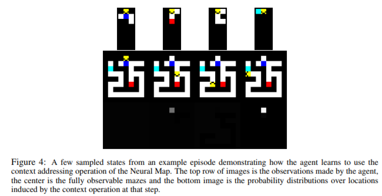
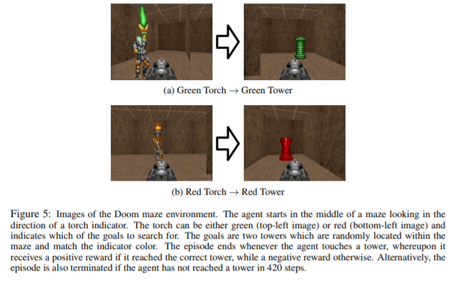

## Intro

In this note, I will briefly summarise some random papers I have read regarding RL.

## [Playing Doom with SLAM-Augmented Deep Reinforcement Learning Shehroze Bhatti et al 2016](https://arxiv.org/pdf/1612.00380.pdf)

this article tackles the issue of partial observability of the environment using SLAM to create the game map.

## [NEURAL MAP: STRUCTURED MEMORY FOR DEEP REINFORCEMENT LEARNING by Emilio Parisotto & Ruslan Salakhutdinov 2017](https://arxiv.org/pdf/1702.08360.pdf)

critical components of DRL is memory which remembers the observations from the environment. but it is still too simple in current research. so in this paper, they develop a memory system, which is using a spatially structured 2D memory image to learn to store arbitrary information about the environment over long time lags, with an adaptable write operator that is customized to the sorts of 3D environments that DRL agents typically interact with.

## [ACTIVE NEURAL LOCALIZATION by D.S.Chaplot et al., 2018](https://arxiv.org/pdf/1801.08214.pdf)

they proposed  “Active Neural Localizer”, a fully differentiable neural network that learns to localize accurately and efficiently. and Active Neural Localizer is trained end-to-end with reinforcement learning. similar concept to the **neural map**.

## [Learning to Navigate in Cities Without a Map by Piotr Mirowski et al., 2018 NIPS](http://papers.nips.cc/paper/7509-learning-to-navigate-in-cities-without-a-map.pdf)

navigation with RL in the real-world.

