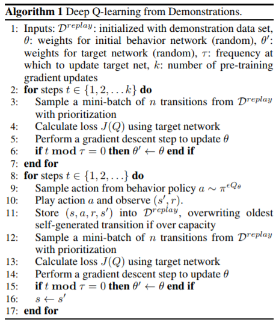
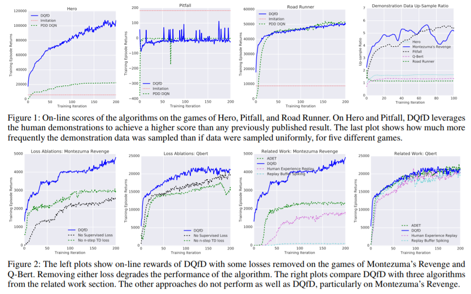
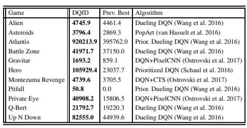

## Main Paper

- Title: Deep Q-learning from Demonstrations
- Authors: Todd Hester et al @ Google DeepMind
- Year: 2017 Nov

## Note

### Summary

- DQfD initially pre-trains solely on the demonstration data using a combination of temporal difference (TD) and supervised losses. The supervised loss enables the algorithm to learn to imitate the demonstrator while the TD loss enables it to learn a self-consistent value function from which it can continue learning with RL. After pre-training, the agent starts interacting with the domain with its learned policy.
- It is proved to outperform state-of-the-art algorithm in 11 games in Atari 2600 game environment

### Problem Statement

- Although DRL has achieved several high profile successes, they require a huge amount of data before reaching the reasonable performance and they tend to perform poorly during its exploration step. In real-world situation, this can not be tolerated
  - they decided to give human's demonstrations
- Compared to other prior works, they found that more intricate loss function is required to pre-train the agent with given demonstrations.
  - they decided to use four different loss function described in **proposition** section
- It was difficult to determine how much we rely on the demonstration in previous work
  - they decided to use **Prioritised Experience Replay mechanism** to efficiently select good demonstrations or good decision-making made by human experts in Replay Memory

### Related Work

- DAgger: [Ross, Gordon, and Bagnell 2011]
  - Iteratively produces new policies based on polling the expert policy outside its original state space, showing that this leads to no-regret over validation data in the online learning sense
  - It requires the expert to be available during training to provide additional feedback to the agent
  - it does not combine imitation with reinforcement learning, meaning it can never learn to improve beyond the expert
- Deeply AggreVaTeD (Sun et al. 2017) extends DAGGER to work with deep neural networks and continuous action spaces.
  - Not only does it require an always available expert like DAGGER does, the expert must provide a value function in addition to action
  - it is limited to just imitate the expert and cannot learn to improve upon the expert
- [Subramanian, Jr., and Thomaz 2016] : Recently, demonstration data has been shown to help in difficult exploration problems in RL
- Inverse RL approaches: (Brys et al. 2015; Suay et al. 2016)
- Training a policy used to sample experience: (Cederborg et al. 2015),
- use policy iteration from demonstrations: (Kim et al. 2013; Chemali and Lezaric 2015)
- Reinforcement Learning with Expert Demonstrations (RLED): (Piot, Geist, and Pietquin 2014a)
  - DQfD is similar concept to this in that they combine TD and classification losses in a batch algorithm in a model-free setting
  - they differ in that the agent is pre-trained on the demonstration data initially and the batch of self-generated data grows over time and is used as experience replay to train deep Q-networks. In addition, a prioritized replay mechanism is used to balance the amount of demonstration data in each mini-batch
- Human Experience Replay (HER) (Hosu and Rebedea 2016) 
  - is an algorithm in which the agent samples from a replay buffer that is mixed between agent and demonstration data, similar to DQfD
  - Yet, human has to put the checkpoint in the game from where the agent to take over and continue playing.
  - Also the result was slightly better than a random agent, so it was not reliable.
- Replay Buffer Spiking(RBS) (Lipton et al. 2016):
  - the DQN agent’s replay buffer is initialized with demonstration data, but they do not pre-train the agent for good initial performance or keep the demonstration data permanently.
- Accelerated DQN with Expert Trajectories (ADET): (Lakshminarayanan, Ozair, and Bengio 2016)
  - They are also combining TD and classification losses in a deep Q-learning setup. They use a trained DQN agent to generate their demonstration data, which on most games is better than human data. It also guarantees that the policy used by the demonstrator can be represented by the apprenticeship agent as they are both using the same state input and network architecture.
  - They use a cross-entropy classification loss rather than the large margin loss DQfD uses and they do not pre-train the agent to perform well from its first interactions with the environment.

### Proposition

#### Algorithm

#### Loss function

- The goal of the pre-training phase is to learn to imitate the demonstrator with a value function that satisfies the Bellman equation so that it can be updated with TD updates once the agent starts interacting with the environment

- During this pre-training phase, the agent samples mini-batches from the demonstration data and updates the network by applying four losses with the weights $\lambda$
  $$
  J(Q) = J_{DQ}(Q) + \lambda_1 J_n(Q) + \lambda_2 J_E(Q) + \lambda_3 J_{L2}(Q)
  $$

  - the 1-step double Q-learning loss: $J_{DQ}(Q)$
  - an n-step double Q-learning loss: $J_n(Q)$
  - a supervised large margin classification loss: $J_E(Q)$
  - L2 regulartisation loss: $J_{L2}(Q)$ avoids over-fitting on the demonstration.

  The supervised loss is used for classification of the demonstrator’s actions, while the Q-learning loss ensures that the network satisfies the Bellman equation and can be used as a starting point for TD learning. If we only use Q-learning updates, the network would update towards the highest values of the actions within encountered small portion of possible actions in demonstrations. So the agent can be assigning unrealistic values to actions at the states in which they saw in demo before actually observing them at next stage(playing on the simulator)

- Loss function(**1-step double Q-learning and supervised large margin classification loss**): 
  $$
  J_E(Q) = \max_{a\in A} [Q(s,a) - l(a_E, a)] - Q(s,a_E)
  $$
  where $a_e$ is the action the expert demonstrator took in state $s$ and $l(a_E, a)$ is a margin function that is 0 when $a = a_E$ and positive otherwise. This loss forces the values of the other actions to be at least a margin lower than the value of the demonstrator’s action. Adding this loss grounds the values of the unseen actions to reasonable values, and makes the greedy policy induced by the value function imitate the demonstrator.

- **n-step returns (with n = 10)** helps propagate the values of the expert’s trajectory to all the earlier states, leading to better pre-training
  $$
  r_t + \gamma r_{t+1} + \cdots + \gamma^{n-1} r_{t+n-1} + \max_a \gamma^n Q(s_{t+n}, a)
  $$

### Experiments

- For all of our experiments, we evaluated three different algorithms, each averaged across four trials:
  - Full DQfD algorithm with human demonstrations
  - PDD DQN learning without any demonstration data
  - Supervised imitation from demonstration data without any environment interaction

- Demo is played by human for **20min**. During game play, we logged the agent’s state, actions, rewards, and terminations. The human demonstrations range from 5,574 to 75,472 transitions per game
- We found that in many of the games where the human player is better than DQN, it was due to DQN being trained with all rewards clipped to 1. Hence, they used unclipped rewards and converted the rewards using a log scale: $r_{\text{agent}} = \text{sign}(r) \cdot \log{ (1 + |r|) }$

### Results

### References

- [Ross, Gordon, and Bagnell 2011] Ross, S.; Gordon, G. J.; and Bagnell, J. A. 2011. A reduction of imitation learning and structured prediction to no-regret online learning. In International Conference on Artificial Intelligence and Statistics (AISTATS).
- [Sun et al. 2017] Sun, W.; Venkatraman, A.; Gordon, G. J.; Boots, B.; and Bagnell, J. A. 2017. Deeply aggrevated: Differentiable imitation learning for sequential prediction. CoRR abs/1703.01030.
- [Subramanian, Jr., and Thomaz 2016] Subramanian, K.; Jr., C. L. I.; and Thomaz, A. 2016. Exploration from demonstration for interactive reinforcement learning. In International Conference on Autonomous Agents and Multiagent Systems (AAMAS).
- [Suay et al. 2016] Suay, H. B.; Brys, T.; Taylor, M. E.; and Chernova, S. 2016. Learning from demonstration for shaping through inverse reinforcement learning. In International Conference on Autonomous Agents and Multiagent Systems (AAMAS).
- [Brys et al. 2015] Brys, T.; Harutyunyan, A.; Suay, H.; Chernova, S.; Taylor, M.; and Now´e, A. 2015. Reinforcement learning from demonstration through shaping. In International Joint Conference on Artificial Intelligence (IJCAI).
- [Cederborg et al. 2015] Cederborg, T.; Grover, I.; Isbell, C.; and Thomaz, A. 2015. Policy shaping with human teachers. In International Joint Conference on Artificial Intelligence (IJCAI 2015).
- [Kim et al. 2013] Kim, B.; Farahmand, A.; Pineau, J.; and Precup, D. 2013. Learning from limited demonstrations. In Advances in Neural Information Processing Systems (NIPS)
- [Chemali and Lezaric 2015] Chemali, J., and Lezaric, A. Direct policy iteration from demonstrations. In International Joint Conference on Artificial Intelligence (IJCAI).
- [Piot, Geist, and Pietquin 2014a] Piot, B.; Geist, M.; and Pietquin, O. 2014a. Boosted bellman residual minimization handling expert demonstrations. In European Conference on Machine Learning (ECML).
- [Hosu and Rebedea 2016] Hosu, I.-A., and Rebedea, T. Playing atari games with deep reinforcement learning and human checkpoint replay. In ECAI Workshop on Evaluating General Purpose AI.
- [Lipton et al. 2016] Lipton, Z. C.; Gao, J.; Li, L.; Li, X.; Ahmed, F.; and Deng, L. 2016. Efficient exploration for dialog policy learning with deep BBQ network & replay buffer spiking. CoRR abs/1608.05081.
- [[Lakshminarayanan, Ozair, and Bengio 2016] Lakshminarayanan, A. S.; Ozair, S.; and Bengio, Y. Reinforcement learning with few expert demonstrations. In NIPS Workshop on Deep Learning for Action and Interaction.](https://drive.google.com/file/d/0B4nMjK_Q9AcRUlQ5RU5nYnhhM2M/view)